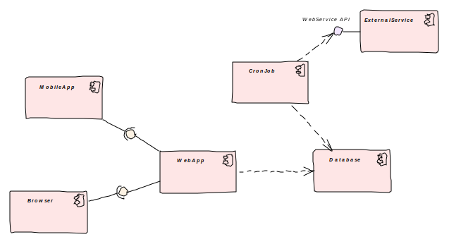
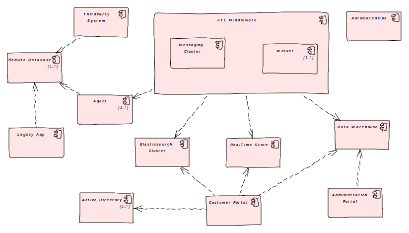

% Efficient Prototyping of Distributed Systems
% Andriy Shapochka, ashapochka@gmail.com
% March 30, 2017

# Challenge

## What Clients Want


## Starting Project for Client



------------------

1. Make architectural decisions
2. Estimate effort, schedule, budget
3. Implement

## What If?



------------------

1. Make architectural decisions
2. **Prototype risky assumptions**
3. **Revise or confirm decisions**
4. Estimate effort, schedule, budget
5. Implement

## What's The Challenge

- Time's short
- Lots of moving parts and unknowns, 
- Prototype *must* work.

# Technology for Prototyping

## Environment: Fly in Cloud!

Amazon AWS or similar Cloud environment rules:

- API to script and automate (reproducible!)
- Quick provisioning resources is a King
- Use available services when possible instead of manual installation

```python
ecs = boto3.client('ecs')
        response = ecs.run_task(
            cluster='poc-jmeters',
            taskDefinition='jmeter',
            overrides=overrides,
            count=task_count,
            startedBy=hostname,
            placementStrategy=placement_strategy)
```

## Deployment - Containerize!

```dockerfile
FROM frolvlad/alpine-oraclejdk8
VOLUME /tmp
VOLUME /config
ADD poc-service-1.0-SNAPSHOT.jar app.jar
RUN sh -c 'touch /app.jar'
ENV JAVA_OPTS=""
ENTRYPOINT [ "sh", "-c", "java $JAVA_OPTS \
-Djava.security.egd=file:/dev/./urandom -jar /app.jar" ]
```

## Operations - Script!

- Counter-intuitive: spend time to script and automate operations
- Continuous Integration: everyone knows how to Jenkins

------------------

```python
@task
def configure_kafka_cluster(ctx, restart_docker=False):
    kafka_node_instances = get_cluster_instances('poc-kafka')
    zoo_cfgs = compose_kafka_node_zoo_cfg(ctx, kafka_node_instances)
    kafka_cfgs = compose_kafka_node_kafka_cfg(ctx, kafka_node_instances)
    for zoo, kafka in zip(zoo_cfgs, kafka_cfgs):
        index, ip, zoo_cfg = zoo
        kafka_cfg = kafka[2]
        with ssh_proxy_bastion(ctx, ip) as ssh_connection:
            ssh_connection.send_command(
                'sudo mkdir -p /data/kafka_data',
                'sudo mkdir -p /data/kafka_conf',
                'sudo mkdir -p /data/kafka_logs',
                'sudo mkdir -p /data/zookeeper_data',
                'sudo sh -c \'printf {} > /data/zookeeper_data/myid\''.format(index),
                'sudo mkdir -p /data/zookeeper_data_logs',
                'sudo mkdir -p /data/zookeeper_logs',
                'sudo mkdir -p /data/zookeeper_conf',
                'sudo sh -c \'printf "{}" > /data/zookeeper_conf/zoo.cfg\''.format(zoo_cfg),
                'sudo sh -c \'printf "{}" > /data/kafka_conf/server.properties\''.format(kafka_cfg),
                "sudo stop ecs" if restart_docker else ":",
                "sudo service docker restart" if restart_docker else ":",
                "sudo start ecs" if restart_docker else ":")
```

## Languages, Frameworks, COTS - Take Shortcuts!

- Quick Start: Spring Boot, Django, RoR, et al.
- COTS: Trial Licenses and Free
- Integration: Kafka, RabbitMQ, JMS, REST
- Great API rules: Elasticsearch - REST, RDBMS - SQL over JDBC/DB API/etc. good client libs...

# Prototype Development Life Cycle

## Team

- Small: 1 to 5 people
- Technical Experts, Productive, Communicators, Self-structured

## Collaboration

- GitHub, GitLab, GitSomething with frequent commits
- Google Drive, Dropbox, Office 365 for documentation editing
- Better still Markdown and similar document formats right in the repository

## Process

- Project duration: 3 to 6 weeks
- Regular team sync-ups and ad-hoc communication
    - But do not waste hours everyday (time is short, remember)
- Weekly or semi-weekly meetings with client
- Keep scope in control
- No Big Bang - Iterative Delivery

# End of Story

## Available at GitHub

[ashapochka/talk-efficient-prototyping](https://github.com/ashapochka/talk-efficient-prototyping)
